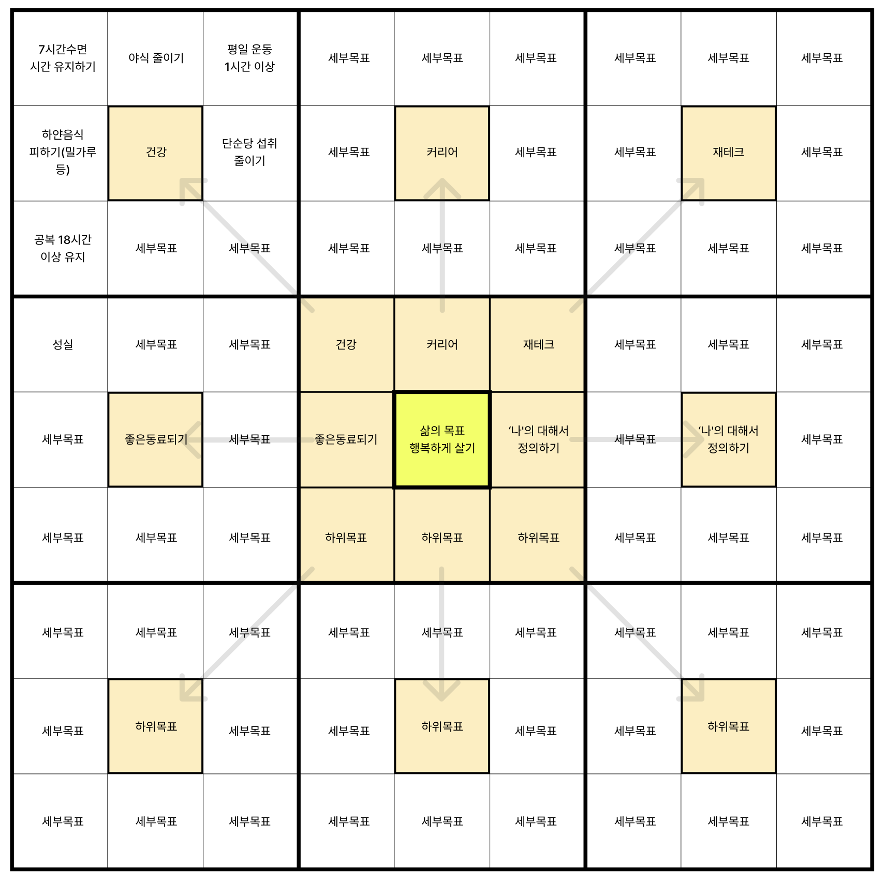

Docusaurus를 사용하여 블로그를 작성하게 되었습니다. 어떤 블로그 도구를 사용할지 고민하던 중 Redux Toolkit 공식 사이트에서 Docusaurus를 사용하고 있었고, 깔끔한 사이트가 마음에 들어 사용하게 되었습니다. 본래 블로그를 잘 사용하지 않으려고 했지만, 개인적인 생각과 공적인 생각을 정리해보고자 블로그를 시작했습니다.

 
또한, 지난 회사에서 사용하던 만다라트를 이용하여 팀의 목표를 정리하고 OKR과 조합하는
것이 괜찮다고 생각했습니다. 특히 만다라트는 개인적인 목표 설정 시 활용해볼 예정입니다.
회사의 만다라트가 존재하고, 각 팀별 혹은 각 파트 혹은 TF별로 만다라트가 존재합니다.
중앙에는 도전적인 Objective를 작성합니다. 만다라트는 회사나 팀의 입장에 따라 Objective가
되기도 하고, KR이 되기도 합니다. 별도의 시트로 Initiative와 KR을 관리합니다. 나를
포함한 회사와 팀의 목표를 일치시키고 목표를 달성하기 위한 방법은 좋은 시도라고 생각합니다.

하지만 계획을 치밀하게 준비하고 실행하는 것은 좋은 것이지만, 그만큼 실행할 때 무게가 무거워지는 느낌이 많이 들었습니다. 예를 들면, 개발을 진행하다 보면 컴포넌트를 하나 만들 때 처음에 생각했던 목표와는 다르게 되는 경우가 많습니다. 그리고 그것을 수정하고 다시 수정하다 보면 목표를 달성하는 데 시간이 많이 소요됩니다. 만다라트와 OKR을 작성하면서 그동안 치밀하게 계획했던 부분을, 방향이 바뀔 수 있는 부분에 대해서도 수정하거나 변경해야 하는 부분에 대해 빠르게 대응할 방법이나 절차가 필요하다는 생각을 하였습니다.

 
상황에 따라 문제를 해결하기 위해 다양한 시도나 관점을 달리 보아야 한다고 생각합니다.
KR이나 Initiative가 너무 상세히 작성되다 보니 오히려 그 틀에 박혀서 다른 관점에서
문제 해결이 잘 보이지 않았던 느낌이 많이 들었습니다. OKR을 처음 적용해 보려고 해서
그럴 수도 있습니다.

> Note: 만다라트는 이전 야구 프리미어12 2015에서 일본과 한국 경기를 보면서 오타니 쇼헤이를 보며 알게 되었습니다. 오타니는 선발투수로 160km를 던지며 우리나라 선수는 1루타조차 치기 어려워 충격을 받았습니다. 그래도 8회와 9회에 기회가 생겨 대한민국이 승리하게 되었습니다. 오타니의 충격이 워낙 커서 프리미어12의 결승전은 보긴 했지만 기억이 잘 나지 않습니다.

오타니가 목표를 이루는 데 만다라트를 사용하고 회사에서도 적극적으로 만다라트를 사용하는 것을 보고 나도 만다라트를 아래와 같이 정리하게 되었습니다. 이후 어느 정도 완성이 되면 블로그에서도 제대로 관리하는 형태로 고민해볼까 합니다.

또한, 다양한 개발 서적과 취미 삼아 읽고 있는 도서들, 그리고 공부하거나 회사 업무로 발생하는 트러블슈팅이나 해결 방법을 정리하고자 합니다. 또한, 내가 고민 중인 것들... 기타 등등...

 
이후에는 블로그를 통해 공유하고자 합니다.
